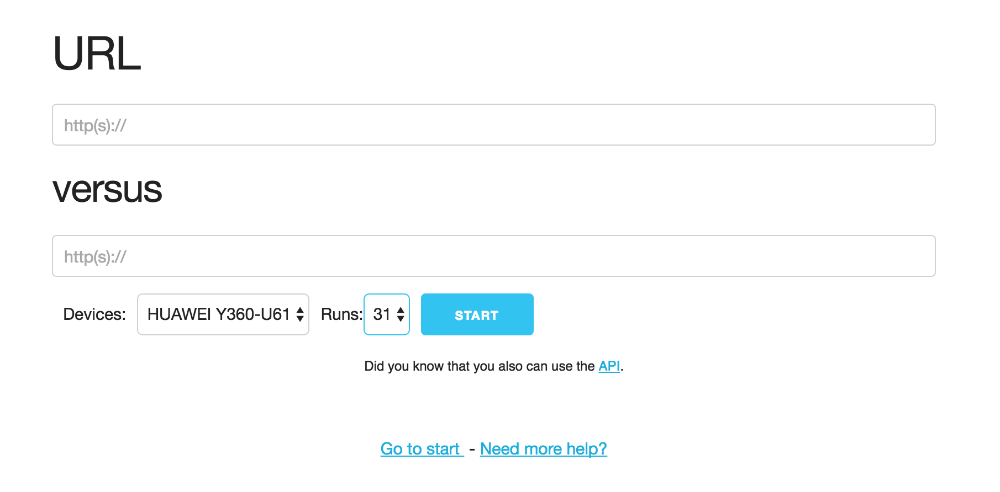
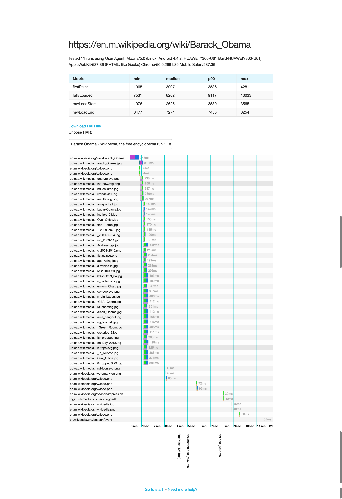

# vs-mobile
Test the performance of your page using your Android phone. Test one page or test two pages versus each others.



# What you get
Your page will be tested using Chrome and metrics will be collected using Javascript from the Navigation Timing API, User Timing API, Resource Timing API and Chromes first paint using [Browsertime](https://github.com/tobli/browsertime). You will get a HAR file containing all the runs. The HAR is displayed using [PerfCascade](https://github.com/micmro/PerfCascade).

The result looks like this:


Checkout [the issues](https://github.com/soulgalore/vs-mobile/issues) what's left to do. 

# Prerequisites

## Desktop
* Install the Android SDK on your desktop: http://developer.android.com/sdk/index.html#downloads
* Start the adb-server on your desktop: adb start-server

## On your phone
* Install Chrome
* Enable developer USB access to your phone: Go to *About device*, tap it, scroll down to the *Build number*, tap it seven (7) times.
* Disable screen lock on your device.
* Enable *Stay awake*
* Enable *USB debugging* in the device system settings, under *Developer options*.
* Install the [Stay Alive app](https://play.google.com/store/apps/details?id=com.synetics.stay.alive) and start it.

## Connectivity
Setup [phuedxs](https://github.com/phuedx) [Micro Device Lab](https://github.com/phuedx/micro-device-lab) and connect your phone to the wifi you want to use.

## Start
```
npm run start
```
